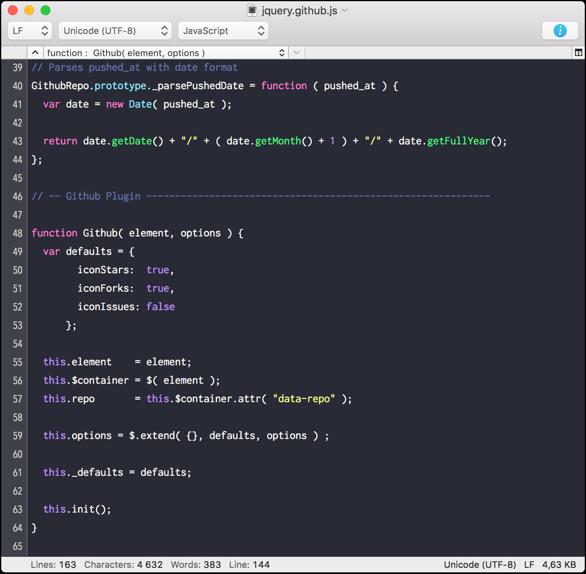

# Dracula for [CotEditor](https://coteditor.com)

> A dark theme for [CotEditor](https://coteditor.com).

## Install

All instructions can be found at [draculatheme.com/CotEditor](https://draculatheme.com/CotEditor).

## Team

This theme is maintained by the following person(s) and a bunch of [awesome contributors](https://github.com/dracula/coteditor/graphs/contributors).

 |
--- |
[William Grant](https://github.com/yougotwill) |

## License

[MIT License](./LICENSE)